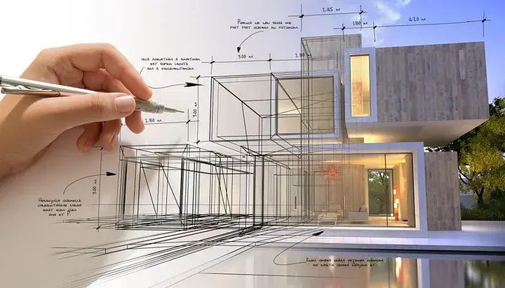
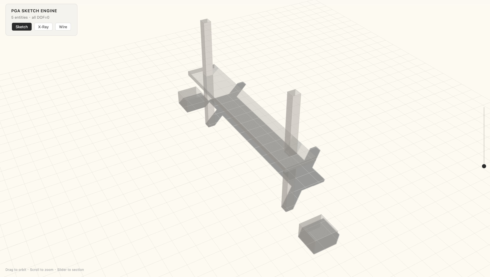
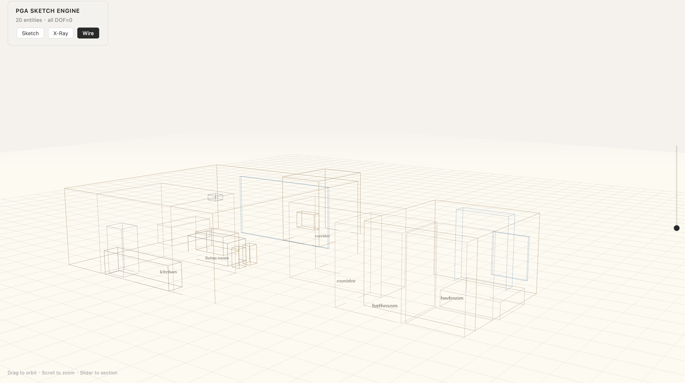
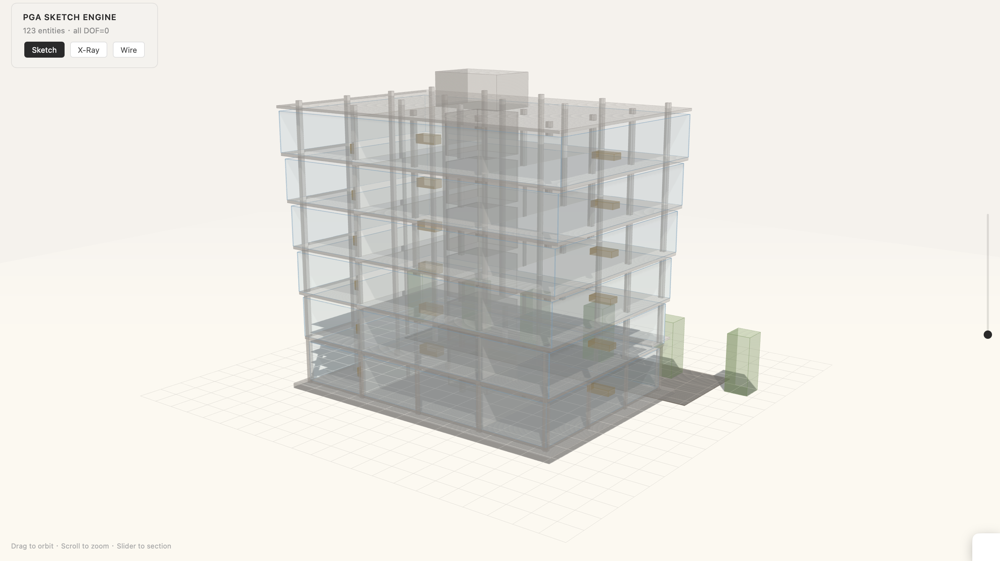

# Mine Architect PGA Sketch Engine

**Text → 3D Architectural Sketch via Projective Geometric Algebra**

---


## Quick Start

### 1. Environment

Requires Node.js v18+ (for native fetch support).

```bash
node -v
```

### 2. Install Dependencies

Initialize your project and install the required packages:

```bash
npm init -y
npm install dotenv
npm install --save-dev typescript ts-node @types/node
```

### 3. TypeScript Configuration

Create a tsconfig.json in the root directory to ensure proper module resolution:

```json
{
  "compilerOptions": {
    "module": "NodeNext",
    "moduleResolution": "NodeNext",
    "esModuleInterop": true,
    "target": "ES2020",
    "strict": true,
    "outDir": "./dist",
    "rootDir": ".",
    "skipLibCheck": true,
    "types": ["node"]
  },
  "include": ["**/*.ts"]
}
```

### 4. Environment Variables

Create a .env file in the root directory and add your API key:

```env
DASHSCOPE_API_KEY=sk-your-actual-api-key
```


### 5. Run

npx ts-node test_reproduce.ts

```bash
npx ts-node src/test_reproduce.ts
```

(Note: Replace test_reproduce.ts with your actual entry file if it differs).

Once completed, the script will generate output_*.html files in your directory. Open them in your web browser to view the generated 3D scenes!
## Test Cases

**Case 1 — Structural (suspension bridge, 5 entities):**
> Two towers on the riverbed. Deck spans between towers. Cables in parabolic curves...



**Case 2 — Chinese prose (apartment, 21 entities):**
> 推开家门，玄关的柔和木质香味先迎了上来。左侧鞋柜的悬空设计让光线在地面投下一道暖光...



**Case 3 — English spec (office tower, 123 entities):**
> A 6-story modern office building with 24m×16m footprint. 5×4 column grid, cantilevered slabs, glass curtain walls on all sides...




## Core Principle

Every rigid body in 3D has 4 DOF (3 position + 1 heading). Each `meet(entity, plane)` constrains the entity to lie on a plane, reducing positional DOF by 1. Three independent planes intersect at exactly one point:

```
π₁ ∧ π₂ ∧ π₃ = P       (PGA triple-meet)
```

This is solved via Cramer's rule on the 3×3 coefficient matrix of the three plane equations. The agent's job is to translate spatial language into plane equations. The algebra handles the rest.

**Agent action space — 3 operations:**

| Operation | Effect | Example |
|-----------|--------|---------|
| `declare(id, type, dims)` | Register entity, DOF=4 | `declare("bed", "bed", [1.8, 0.55, 2.1])` |
| `meet(entity, [nx,ny,nz,d])` | Constrain with plane, DOF−1 | `meet("bed", [1, 0, 0, -10.1])` → x=10.1 |
| `orient(entity, angle)` | Set heading, DOF−1 | `orient("bed", -90)` → facing east |


## Convergence Guarantee

Total DOF = 4N. Each operation reduces DOF by 1. DOF ≥ 0. Therefore convergence is guaranteed in at most 4N steps. The question is only what percentage comes from text vs. defaults:

```
Apartment (N=21):  text=77%, defaults=23%
Office (N=123):    text=75%, defaults=25%  (orientation defaults)
```


## Architecture

```
INPUT: any text
  │
  ▼
STAGE 1 — Preprocessor (1 LLM call, best model)
  │  Raw text → normalized sentences
  │  Resolve ambiguity, make implicits explicit, strip rhetoric
  ▼
STAGE 2 — Solver Agent (N LLM calls, any model)
  │  For each sentence:
  │    Agent sees:  entity states + full text + current sentence
  │    Agent picks: PGA operations (declare / meet / orient)
  │    Engine runs: plane intersection via Cramer's rule
  │    DOF decreases
  ▼
REMAINING DOF > 0 → defaults OR feedback loop to Stage 1
  │
  ▼
STAGE 3 — Render (0 LLM calls)
  │  Solved positions → Three.js HTML
  ▼
OUTPUT: interactive 3D sketch (.html)
```

## Limitations & Roadmap

While the 4N DOF reduction provides a strict mathematical guarantee for convergence, a gap remains between theoretical proof and production-grade engineering.

### 1. The Alignment Gap

Currently, there is a misalignment between **semantic subspace consistency** (the LLM's spatial reasoning) and **boundary consistency** (the PGA geometric constraints).

- **Prompting Limits:** The semantic subspace remains inconsistent because we currently rely entirely on generic prompting methods.
- **Generality Penalty:** The usage scenario is not sharply defined due to the "any text in" generalized approach, leading to a dilution of domain-specific accuracy.

### 2. Future Direction: The Self-Play Loop

Both limitations can be addressed simultaneously by transitioning from prompting to a fine-tuning flywheel:

- **Phase 1 (Cold Start):** Use powerful frontier models (GPT-4o, Claude 3.5, etc.) driven by this architecture as a data engine to generate highly accurate, mathematically verified text-to-PGA synthetic datasets.
- **Phase 2 (Domain Fine-Tuning):** Use this pipeline to train a smaller, domain/usage-specific model (e.g., focused strictly on architectural specs or interior design).
- **Phase 3 (Self-Play):** Deploy the fine-tuned model to generate further diverse, high-quality data, creating a continuous self-play loop that progressively aligns semantic intent with geometric reality.